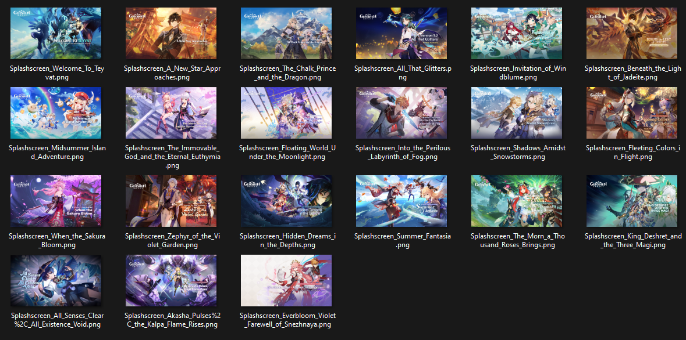
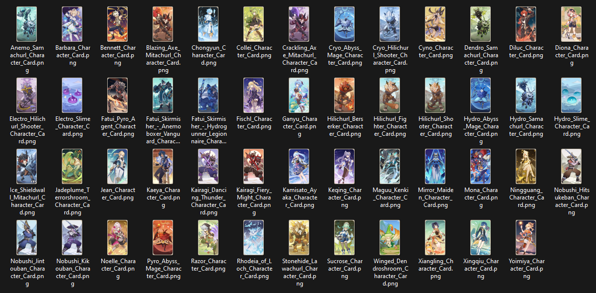
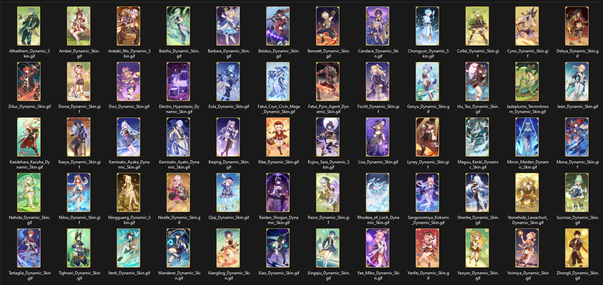
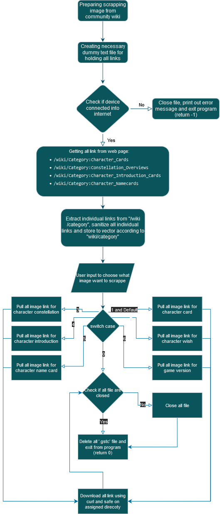

## Intro

This is a console programme which using `Gumbo`, `indicators`, `cpr`, `argparse` and `cUrl` for scrape all character card image, wish image and contellation images from Genshin Impact Wiki Fandom, as [Tree Directory below](##Web-Tree-Directory), all image file is contained into a CDN server. For the image it's always get latest version and uncroped version. Docker image build are available.

## Web Tree Directory

<pre>

Genshin Wiki Fandom (https://genshin-impact.fandom.com/wiki/Genshin_Impact_Wiki)
└── ...
    ├── Wiki Fandom Character Category Page (https://genshin-impact.fandom.com/wiki/Category:Character_Cards)
    │   └── Character Page (https://genshin-impact.fandom.com/wiki/*Character_Name*)
    │       ├── ...
    │       ├── Character Card Image (Static_CDN_File [https://static.wikia.nocookie.net/gensin-impact/images/*unique_character*/*unique_number_character*/*Character_Name*_Card.png/revision/latest/])
    │       ├── Character Wish Image (Static_CDN_File [https://static.wikia.nocookie.net/gensin-impact/images/*unique_character*/*unique_number_character*/*Character_Name*_Wish.png/revision/latest/])
    │       └── ...
    ├── Wiki Fandom Constellations Category Page (https://genshin-impact.fandom.com/wiki/Category:Constellation_Overviews)
    │   └── Constellation Page (https://genshin-impact.fandom.com/wiki/*Constellation_Name*)
    │       ├── ...
    │       ├── Constellation Image (Static_CDN_File [https://static.wikia.nocookie.net/gensin-impact/images/*unique_character*/*unique_number_character*/*Constellation_Name*.png/revision/latest])
    │       └── ...
    ├── Wiki Fandom Character Introduction Page (https://genshin-impact.fandom.com/wiki/Category:Character_Introduction_Cards)
    │   └── Character Media Page (https://genshin-impact.fandom.com/wiki/*character_name*/Media)
    │       ├── ...
    │       ├── Character Introduction Card Image (Static_CDN_File [https://static.wikia.nocookie.net/gensin-impact/images/*unique_character*/*unique_number_character*/*Character_Name*_Introduction.png/revision/latest/])
    │       ├── Character Namecard Image (Static_CDN_File [https://static.wikia.nocookie.net/gensin-impact/images/*unique_character*/*unique_number_character*/*Name_Card_Name*.png/revision/latest/])
    │       └── ...
    ├── Wiki Fandom Version page (https://genshin-impact.fandom.com/wiki/Version)
    │   ├── ...
    │   ├── Version Splashscreen Image (Static_CDN_File [https://static.wikia.nocookie.net/gensin-impact/images/*unique_character*/*unique_character_number*/Splashscreen_*Version_Name*.png/revision/latest/])
    │   └── ...
    ├── Wiki Fandom TGC Character Card Page (https://genshin-impact.fandom.com/wiki/Category:Genius_Invokation_TCG_Character_Cards)
    │   ├── ...
    │   ├── Character TGC Card Image (Static_CDN_File [https://static.wikia.nocookie.net/gensin-impact/images/*unique_number*/*unique_character_number*/*Character_Name*_Character_Card.png/revision/latest/])
    │   ├── Character Dymanics TGC Card Image (Static_CDN_File [https://static.wikia.nocookie.net/gensin-impact/images/*unique_character*/*unique_number_charac_character*/*character_name*.gif/revision/latest])
    │   └── ...
    └── Wiki Fandom Namecard Page (https://genshin-impact.fandom.com/wiki/Category:Character_Namecards)
        ├── ...
        ├── Character Namecard Background Image (Static_CDN_File [https://static.wikia.nocookie.net/gensin-impact/images/*unique_character*/*unique_number_charac_character*/*namecard_name*.png/revision/latest/])
        ├── Battle Pass Namecard Background Image (Static_CDN_File [https://static.wikia.nocookie.net/gensin-impact/images/*unique_character*/*unique_number_charac_character*/*namecard_name*.png/revision/latest])
        └── ...

</pre>

## Sample Output







## To-Do

- [x] Scrap all character link from `/wiki/Category:Character_Card`.
- [x] Scrap all character card images link from each character links to file.
- [x] Get character images card HD and uncropped.
- [x] Download all character card images.[^img_download_cards]
- [x] Get character images wish HD and uncropped.
- [x] Download all character wish images.[^img_download_wishes]
- [x] Scrap all character link from `/wiki/Category:Constellation_Overviews`.
- [x] Scrap all constellation images link from each character constellation link to file.
- [x] Get character constellation images HD and uncropped.[^img_download_const]
- [x] Scrap all character introduction images link from `/wiki/Category:Character_Introduction_Cards`.
- [x] Scrap all character introduction images link for each character.
- [x] Download all character introduction images HD and uncropped.[^img_download_intro]
- [x] Scrap all character namecard images link from `/wiki/Category:Character_Namecards`.
- [x] Scrap all character namecard images link for each character.
- [x] Download all character namecard images HD and uncropped.[^img_download_namecard]
- [x] Adding internet check. [^macOS_imp_and_android_imp]
- [x] Create seperated folder for character Wish and Card images.
- [x] Deploy into docker.[^docker_footnote]
- [x] Compile for Linux (x86 and x64).
- [x] Compile for ARM (armv7l and arm64).
- [x] Compile for Android (armv7l, arm64, x86 and x64).
- [x] Display file name when downloading file.
- [x] Scrap all genshin version image link from `/wiki/Version`.
- [x] Download all version image HD and uncroppped.[^img_download_version]
- [x] Scrap all character TCG card images link from `/wiki/Category:Character_Introduction_Cards`.
- [x] Scrap all character TCG card images link for each character.
- [x] Download all character TCG card images HD and uncropped.[^img_download_tcg]
- [x] Scrap all dynamics character TCG card images link for each character.
- [x] Download all dynamics character TCG card images HD and uncropped.[^img_download_tcg_dyn]
- [x] Make program can took command line arguments.
- [ ] Compile for macOS (x64 and arm64).
- [ ] Adding feature for download certain character.

## Build from scratch

For who like to build this apps, you need to download `vcpkg` to get neccesary dependency, which can be done with visiting [vcpkg](https://vcpkg.io/en/getting-started.html) website. After `vcpkg` already installed, you need install all dependency with command below (assume your working directory is inside on `../../vcpkg`):
```
vcpkg install gumbo cpr curl indicators argparse --triplet x64-{YOUR_OS}-static
```   
> **Note**
> You can list all supported and available triplet by using `vcpkg help triplet` command.   
After all dependency is installed there are separate method for building this project.
1. Linux build   
After installing all dependency, make a folder on root of this project `mkdir build && cd WebScrapperGenshinCharacterCard`. After that run below command:
   ```
   cmake -B ../build -S . -DCMAKE_TOOLCHAIN_FILE=[YOUR_VCPKG_PATH]/scripts/buildsystems/vcpkg.cmake
   ```
    after `cmake` successfully generate `makefile`, go to build folder using this command `cd ../build && make all` or you can use `cmake --build ../build`. After all completed the executable are in your working directory, for use the program just simply run `./wsgcc_{YOUR_OS}_{OS_ARCH}` if build on architecture `x86_64` and for Linux it will generate `./wsgcc_linux_x64`.
2. Windows Build   
After installing all dependency you need to run this command `vcpkg integrate install` to order Visual Studio can compile it. It's more recommended to compile using Visual Studio 2022. You can build using `x64` architecture, unless you download `x86` using `vcpkg`. The executable is located on `D:\...\...\WebScrapperGenshinCharacterCard\wsgcc_win_x64.exe`, assuming your working directory in `D:\`.   
3. Docker Build[^docker_footnote]   
There are 2 method for using Docker build:
   - Using dockerfile   
     if you want to build your own image you can use available docker file just simply run:
     ```
      docker build --no-cache -t totmalone/wsgcc:latest -f ./Dockerfile .
     ```
     After the image done building just simply run the image using:
     ```
     docker run -it --rm -w /root/WSGCC/WebScrapperGenshinCharacterCard --name=wsgcc totmalone/wsgcc:latest ash
     ```
     If docker image successfully run, just simply run `./wsgcc_{YOUR_OS}_{OS_ARCH}` if build on architecture `x86_64` and for Linux it will generate `./wsgcc_linux_x64`. To get desire image folder just run, `mkdir genshin_images && docker cp wsgcc:/<folder_name> genshin_images/`.
    - Using Docker hub   
    If you want use pre-build image you just simply run `docker pull totmalone/wsgcc`, after docker image successfully get pulled just simply run the image using:
      ```
      docker run -it --rm -w /root/WSGCC/WebScrapperGenshinCharacterCard --name=wsgcc totmalone/wsgcc:latest ash
      ```
      If docker image successfully run, just simply run `./wsgcc_{YOUR_OS}_{OS_ARCH}` if build on architecture `x86_64` and for Linux it will generate `./wsgcc_linux_x64`. To get desire image folder just run, `mkdir genshin_images && docker cp wsgcc:/<folder_name> genshin_images/`.   
4. Android Build[^android_footnote]   
For building for android you need, installed `vcpkg` dependency which must suited with your android device architecture, after all dependecy installed you need download `android ndk` which you can get on [ndk_downloads](https://developer.android.com/ndk/downloads) or you can use `curl -O https://dl.google.com/android/repository/android-ndk-{NDK_VERSION}-{YOUR OPERATING_SYSTEM}.zip`. After all dependecy you need to `export` all path for easier compiling and linking, for example:
    ```
    export VCPKG_ROOT=~/Documents/vcpkg && export export ANDROID_NDK_HOME=~/Documents/android-ndk-r25c && export vcpkg_toolchain_file=$VCPKG_ROOT/scripts/buildsystems/vcpkg.cmake && export android_toolchain_file=$ANDROID_NDK_HOME/build/cmake/android.toolchain.cmake && export android_abi=x86 && export vcpkg_target_triplet=x86-android
    ```   
    > **Note**
    > For `android_abi` and `vcpkg_target_triplet` can be modified as needed, for reference
    > [microsoft guide for android abi](https://learn.microsoft.com/en-us/vcpkg/users/platforms/android#vcpkg-triplets-and-their-corresponding-android-abi).  
    
    After that run code below:
    ```
    cmake -B ../build -S . -DCMAKE_TOOLCHAIN_FILE=$vcpkg_toolchain_file -DVCPKG_CHAINLOAD_TOOLCHAIN_FILE=$android_toolchain_file -DVCPKG_TARGET_TRIPLET=$vcpkg_target_triplet -DANDROID_ABI=$android_abi -DANDROID_PLATFORM=25 -DVCPKG_TARGET_ANDROID=ON
    ```
    after `cmake` successfully generate `makefile`, go to build folder using this command `cd ../build && make all` or you can use `cmake --build ../build`. After all completed the executable are in your working directory, for use the program just simply run `./wsgcc_{YOUR_OS}_{OS_ARCH}` if build on android ABI `arm64-v8a` it will generate `./wsgcc_android_arm64`. You can run the compiled binary using [termux](https://f-droid.org/en/packages/com.termux/), just simply clone this repository and run the binary file.
    > **Note**
    > For `termux` it isn't possible to build from there, because termux aren't supported advance Linux filesystem which may required to build this project.
    > What tested is `vcpkg` successful installed, `vcpkg` package failed to install due `make` unbale to write file into `termux`.

## Misc

For whom interested how this programme work, this project have a decent flowchart to follow with:


## Citation

ASCII Tree Directory powered by: [ASCII Tree Generator](https://codepen.io/weizhenye/details/eoYvye).   
This project powered by: [vcpkg](https://vcpkg.io/en/getting-started.html), [gumbo](https://github.com/google/gumbo-parser), [cpr](https://github.com/libcpr/cpr), [cUrl](https://curl.se/libcurl/), [indicators](https://github.com/p-ranav/indicators), [argparse](https://github.com/p-ranav/argparse) and [C++20](https://isocpp.org/std/the-standard).   
Data sources: [genshin wiki fandom](https://genshin-impact.fandom.com/wiki/Genshin_Impact_Wiki).   

### Footnote
[^macOS_imp_and_android_imp]: For macOS and Android implementation for internet check are limited, since this project are pure C++ and I don't want to call `system()` (it's already memory heavy). ~~The function always return `true`.~~ The function are using `cUrl` to get response from `www.google.com`.
[^img_download_cards]: For character card images are downloaded into a folder named `Character Genshin Card Image`.
[^img_download_wishes]: For character wish images are downloaded into a folder named `Character Genshin Wish Image`.
[^img_download_const]: For character constellation images are downloaded into a folder named `Character Genshin Constellation Image`.
[^img_download_intro]: For character introduction images are downloaded into a folder named `Character Genshin Introduction Card Image`.
[^img_download_namecard]: For character namecard images are downloaded into a folder named `Character Genshin Namecard Image`.
[^img_download_tcg]: For TCG character card images are downloaded into a folder named `Genshin TGC Character Card Image`.
[^img_download_tcg]: For TCG dynamics character card images are downloaded into a folder named `Genshin TGC Dynamics Character Card Image`.
[^img_download_version]: For genshin version images are downloaded into a folder named `Genshin Version Images`.
[^docker_footnote]: Assumed docker already installed into the device.
[^android_footnote]: For installing could use `termux` ~~and `adb`~~.