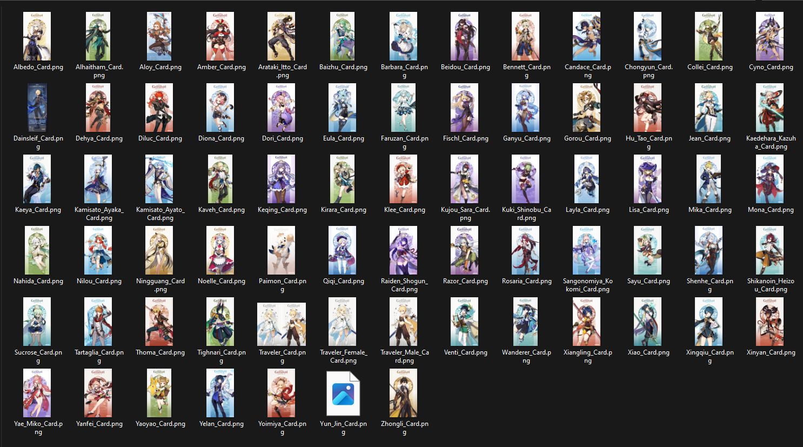
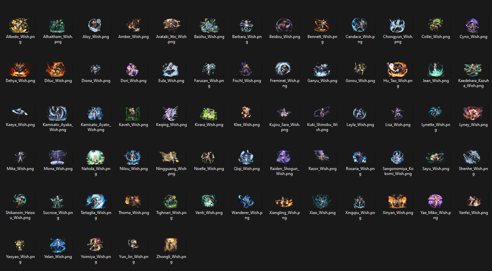

## Intro

This is a console programme which using `Gumbo`, `cpr`, and `cUrl` for scrape all character card image from Genshin Impact Wiki Fandom, as [Tree Directory below](##Web-Tree-Directory), all image file is contained into a CDN server. For the image it's always get latest version and uncroped version.

## Web Tree Directory

<pre>
Genshin Wiki Fandom (https://genshin-impact.fandom.com/wiki/Genshin_Impact_Wiki)
└── ...
    └── Wiki Fandom Category Page (https://genshin-impact.fandom.com/wiki/Category:Character_Cards)
        └── Character Page (https://genshin-impact.fandom.com/wiki/*Character_Name*)
            ├── ...
            ├── Character Card Image (Static_CDN_File [https://static.wikia.nocookie.net/gensin-impact/images/8/8d/*Character_Name*_Card/revision/latest/])
            ├── Character Wish Image (Static_CDN_File [https://static.wikia.nocookie.net/gensin-impact/images/8/8d/*Character_Name*_Wish/revision/latest/])
            └── ...
</pre>

## Sample Output

## To-Do

- [x] Scrap all character link from `/wiki/Category:Character_Card`.
- [x] Scrap all character card images link from each character links from file.
- [x] Get character images card HD and uncropped.
- [x] Download all character card images.[^img_download_cards]
- [x] Get character images wish HD and uncropped.
- [x] Download all character wish images.[^img_download_wishes]
- [x] Adding internet check. [^macOS_imp_and_android_imp]
- [x] Create seperated folder for character Wish and Card images.
- [x] Compile for Linux (~~x86 and~~ x64 Only).
- [ ] Compile for macOS (x64 and arm64).
- [ ] Compile for ARM(arm64 and armv7l).

## Citation

ASCII Tree Directory powered by: [ASCII Tree Generator](https://codepen.io/weizhenye/details/eoYvye).   
This project powered by: [gumbo](https://github.com/google/gumbo-parser), [cpr](https://github.com/libcpr/cpr), [cUrl](https://curl.se/libcurl/) and [C++20](https://isocpp.org/std/the-standard).   
Data sources: [genshin wiki fandom](https://genshin-impact.fandom.com/wiki/Genshin_Impact_Wiki).   

### Footnote
[^macOS_imp_and_android_imp]: For macOS and Android implementation for internet check are limited, since this project are pure C++ and I don't want to call `system()` (it's already memory heavy). ~~The function always return `true`.~~ The function are using `cUrl` to get response from `www.google.com`.  
[^img_download_cards]: For character card images are downloaded into a folder named `Character Genshin Card Image`.
[^img_download_wishes]: For character wish images are downloaded into a folder named `Character Genshin Wish Image`.