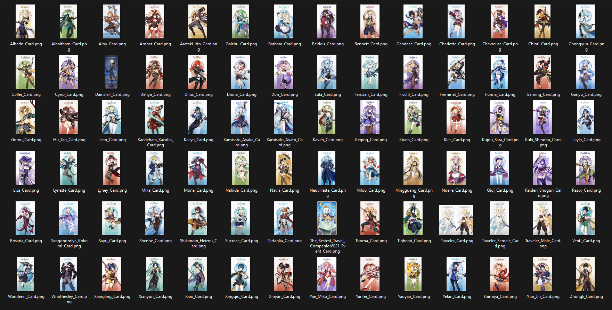
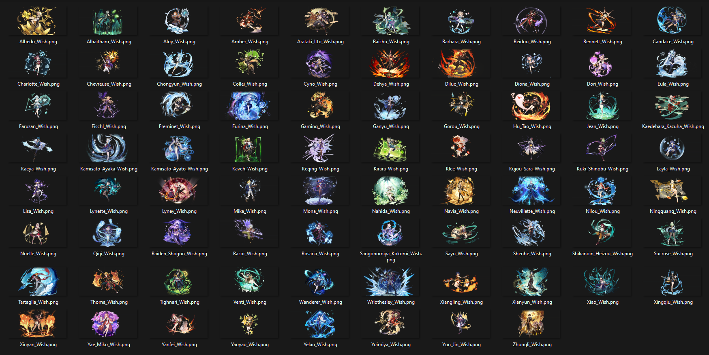

## Intro

This is a console programme which using `Gumbo`, `indicators`, `cpr`, and `cUrl` for scrape all character card image, wish image and contellation images from Genshin Impact Wiki Fandom, as [Tree Directory below](##Web-Tree-Directory), all image file is contained into a CDN server. For the image it's always get latest version and uncroped version. Docker image build are available.

## Web Tree Directory

<pre>
Genshin Wiki Fandom (https://genshin-impact.fandom.com/wiki/Genshin_Impact_Wiki)
└── ...
    ├── Wiki Fandom Character Category Page (https://genshin-impact.fandom.com/wiki/Category:Character_Cards)
    │   └── Character Page (https://genshin-impact.fandom.com/wiki/*Character_Name*)
    │       ├── ...
    │       ├── Character Card Image (Static_CDN_File [https://static.wikia.nocookie.net/gensin-impact/images/*unique_character*/*unique_number_character*/*Character_Name*_Card.png/revision/latest/])
    │       ├── Character Wish Image (Static_CDN_File [https://static.wikia.nocookie.net/gensin-impact/images/*unique_character*/*unique_number_character*/*Character_Name*_Wish.png/revision/latest/])
    │       └── ...
    ├── Wiki Fandom Constellations Category Page (https://genshin-impact.fandom.com/wiki/Category:Constellation_Overviews)
    │   └── Constellation Page (https://genshin-impact.fandom.com/wiki/*Constellation_Name*)
    │       ├── ...
    │       ├── Constellation Image (Static_CDN_File [https://static.wikia.nocookie.net/gensin-impact/images/*unique_character*/*unique_number_character*/*Constellation_Name*.png/revision/latest])
    │       └── ...
    └── Wiki Fandom Character Introduction Page (https://genshin-impact.fandom.com/wiki/Category:Character_Introduction_Cards)
        └── Character Media Page (https://genshin-impact.fandom.com/wiki/Albedo/Media)
            ├── ...
            ├── Character Introduction Card Image (Static_CDN_File [https://static.wikia.nocookie.net/gensin-impact/images/*unique_character*/*unique_number_character*/*Character_Name*_Introduction.png/revision/latest/])
            ├── Character Namecard Image (Static_CDN_File [https://static.wikia.nocookie.net/gensin-impact/images/*unique_character*/*unique_number_character*/*Name_Card_Name*.png/revision/latest/])
            └── ...
</pre>

## Sample Output





## To-Do

- [x] Scrap all character link from `/wiki/Category:Character_Card`.
- [x] Scrap all character card images link from each character links to file.
- [x] Get character images card HD and uncropped.
- [x] Download all character card images.[^img_download_cards]
- [x] Get character images wish HD and uncropped.
- [x] Download all character wish images.[^img_download_wishes]
- [x] Scrap all character link from `/wiki/Category:Constellation_Overviews`.
- [x] Scrap all constellation images link from each character constellation link to file.
- [x] Get character constellation images HD and uncropped.[^img_download_const]
- [x] Scrap all character introduction images link from `/wiki/Category:Character_Introduction_Cards`.
- [x] Scrap all character introduction images link for each character.
- [x] Download all character introduction images HD and uncropped.[^img_download_intro]
- [x] Scrap all character namecard images link from `/wiki/Category:Character_Namecards`.
- [x] Scrap all character namecard images link for each character.
- [x] Download all character namecard images HD and uncropped.[^img_download_namecard]
- [x] Adding internet check. [^macOS_imp_and_android_imp]
- [x] Create seperated folder for character Wish and Card images.
- [x] Deploy into docker.[^docker_footnote]
- [x] Compile for Linux (~~x86 and~~ x64 only).
- [x] Compile for ARM (~~armv7l and~~ arm64 only).
- [ ] Compile for macOS (x64 and arm64).
- [x] Display file name when downloading file.
- [ ] Adding feature for download certain character.

## Build from scratch

For who like to build this apps, you need to download `vcpkg` to get neccesary dependency, which can be done with visiting [vcpkg](https://vcpkg.io/en/getting-started.html) website. After `vcpkg` get setup you need install all dependency with command below (assume your working directory is inside on `../../vcpkg`):
```
vcpkg install gumbo cpr curl indicators --triplet x64-{YOUR_OS}-static
```
After all dependency is installed there are separate method for building this project.
1. Linux build   
After installing all dependency, make a folder on root of this project `mkdir build && cd WebScrapperGenshinCharacterCard`. After that run below command:
   ```
   cmake -B ../build -S . -DCMAKE_TOOLCHAIN_FILE=[YOUR_VCPKG_PATH]/scripts/buildsystems/vcpkg.cmake
   ```
    after `cmake` successfully generate `makefile`, go to build folder using this command `cd ../build && make all` or you can use `cd ../build && cmake --build`. After all completed the executable are in your working directory, for use the program just simply run `./wsgcc_amd64` if build on architecture `x86_64`, or `./wsgcc_arm64` on architecture `aarch64` and `./wsgcc_gen` for unknown architecture.
2. Windows Build   
After installing all dependency you need to run this command `vcpkg integrate install` to order Visual Studio can compile it. It's more recommended to compile using Visual Studio 2022. You can build using `x64` architecture, unless you download `x86` using `vcpkg`. The executable is located on `..\x64\{Release or Debug}\WebScrapperGenshinCharacterCard.exe`.   
3. Docker Build[^docker_footnote]   
There are 2 method for using Docker build:
   - Using dockerfile   
     if you want to build your own image you can use available docker file just simply run:
     ```
      docker build --no-cache -t totmalone/wsgcc:latest -f ./Dockerfile .
     ```
     After the image done building just simply run the image using:
     ```
     docker run -it --rm -w /root/WSGCC/WebScrapperGenshinCharacterCard --name=wsgcc totmalone/wsgcc:latest ash
     ```
     If docker image successfully run, just simply run the application `./wsgcc_amd64` if build on architecture `x86_64`, or `./wsgcc_arm64` on architecture `aarch64` and `./wsgcc_gen` for unknown architecture. To get desire image folder just run, `mkdir genshin_images && docker cp wsgcc:/<folder_name> genshin_images/`.
    - Using Docker hub   
    If you want use pre-build image you just simply run `docker pull totmalone/wsgcc`, after docker image successfully get pulled just simply run the image using:
      ```
      docker run -it --rm -w /root/WSGCC/WebScrapperGenshinCharacterCard --name=wsgcc totmalone/wsgcc:latest ash
      ```
      If docker image successfully run, just simply run the application `./wsgcc_amd64` if build on architecture `x86_64`, or `./wsgcc_arm64` on architecture `aarch64` and `./wsgcc_gen` for unknown architecture. To get desire image folder just run, `mkdir genshin_images && docker cp wsgcc:/<folder_name> genshin_images/`.

## Citation

ASCII Tree Directory powered by: [ASCII Tree Generator](https://codepen.io/weizhenye/details/eoYvye).   
This project powered by: [vcpkg](https://vcpkg.io/en/getting-started.html), [gumbo](https://github.com/google/gumbo-parser), [cpr](https://github.com/libcpr/cpr), [cUrl](https://curl.se/libcurl/) and [C++20](https://isocpp.org/std/the-standard).   
Data sources: [genshin wiki fandom](https://genshin-impact.fandom.com/wiki/Genshin_Impact_Wiki).   

### Footnote
[^macOS_imp_and_android_imp]: For macOS and Android implementation for internet check are limited, since this project are pure C++ and I don't want to call `system()` (it's already memory heavy). ~~The function always return `true`.~~ The function are using `cUrl` to get response from `www.google.com`.  
[^img_download_cards]: For character card images are downloaded into a folder named `Character Genshin Card Image`.
[^img_download_wishes]: For character wish images are downloaded into a folder named `Character Genshin Wish Image`.
[^img_download_const]: For character constellation images are download into a folder named `Character Genshin Constellation Image`.
[^img_download_intro]: For character constellation images are download into a folder named `Character Genshin Introduction Card Image`.
[^img_download_namecard]: For character constellation images are download into a folder named `Character Genshin Namecard Image`.
[^docker_footnote]: Assumed docker already installed into the device.